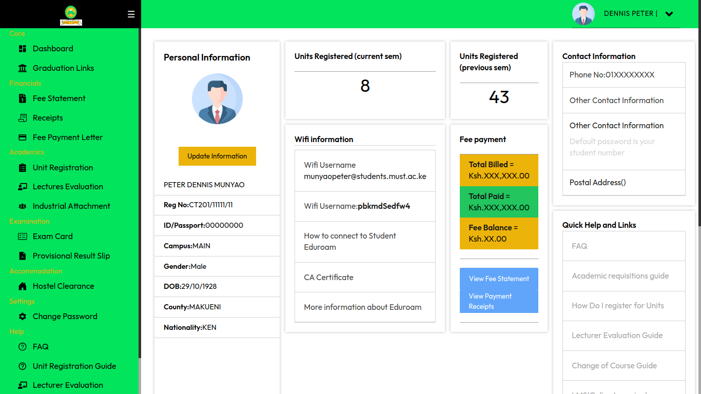
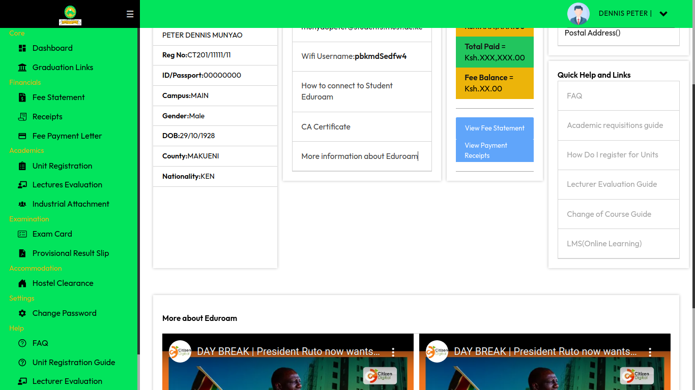
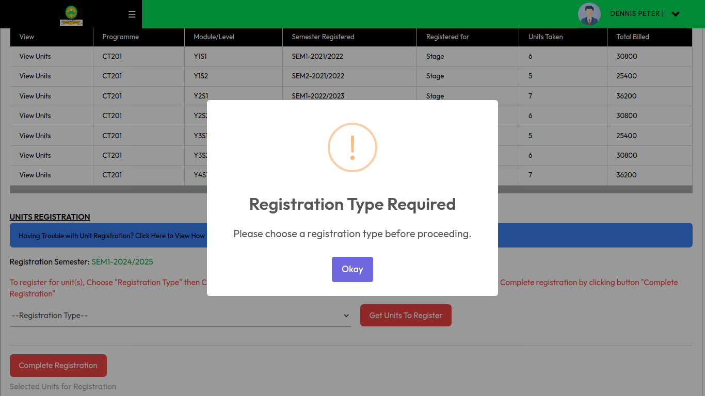
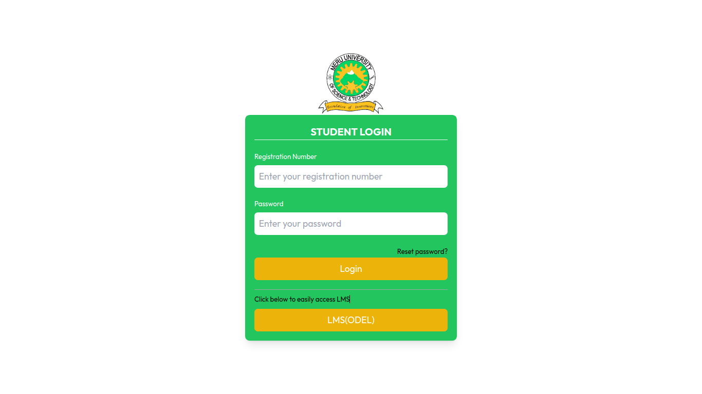
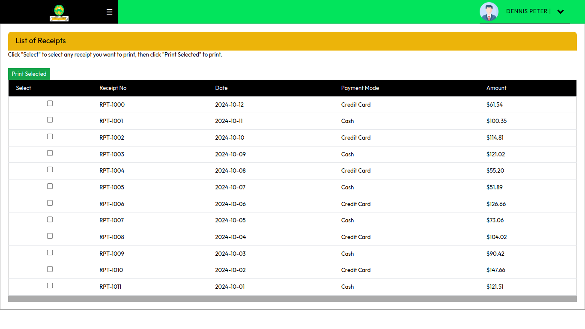

# University Student Portal Clone

This project is a clone of our university's student portal interface. The project is built using **React**, **Redux Toolkit** for state management, and **Tailwind CSS** for styling. The objective is to replicate the student portal's user interface and functionality to provide a consistent, responsive, and interactive experience.

## Table of Contents

1. [Features](#features)
2. [Screenshots](#screenshots)
3. [Getting Started](#getting-started)
4. [Installation](#installation)
5. [Usage](#usage)
6. [Project Structure](#project-structure)
7. [Available Scripts](#available-scripts)
8. [Contributing](#contributing)
9. [License](#license)

## Features

- **Authentication**: User login with simulated authentication
- **Dashboard**: Main landing area with access to student resources
- **Profile Management**: Editable user profile section
- **Course Information**: View current and completed courses
- **Grades and Transcripts**: Access grade reports and transcripts
- **Notifications**: Interactive notifications and updates
- **Responsive Design**: Optimized for both desktop and mobile devices

## Some Screenshots

Here are some screenshots of the application:


*Receipts section*


*Dashboard showcasing student resources*


*Units registration, for the case unit's to register not taken*


*Login display*


*Receipts section*

## Getting Started

To get started with this project, you will need to have **Node.js** installed on your machine.

### Prerequisites

- [Node.js](https://nodejs.org/) (v14+ recommended)
- [NPM](https://www.npmjs.com/) or [Yarn](https://yarnpkg.com/)
- Basic knowledge of **React** and **Redux Toolkit**

## Installation

Clone the repository:

   ```bash
   git clone https://github.com/Ritahchanger/Meru-university-student-portal-clone.git
   ```
Install node_modules:

   ```bash
   npm install
```

Run the application

```bash
npm run start